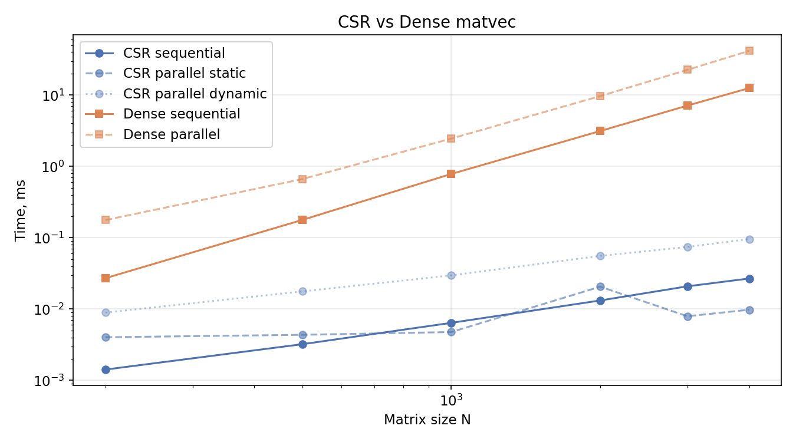
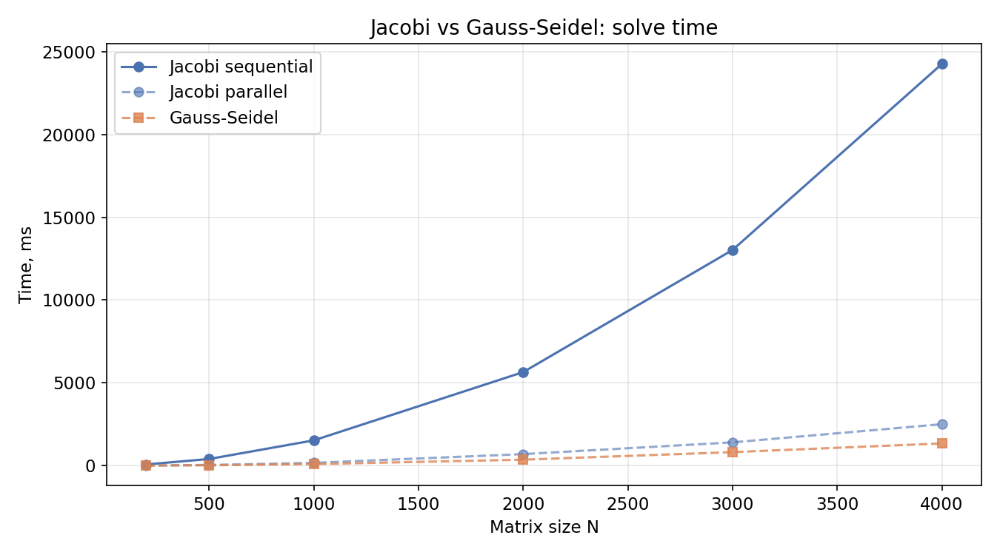

# OpenMP basics: Iterative SLAE Solvers & Sparse Matrix Operations

**Header-only C++23 библиотека итерационных методов решения СЛАУ с поддержкой параллельных вычислений через OpenMP.**

> [!note]
> Проект ориентирован на сравнение производительности последовательных и параллельных реализаций 
> некоторых базовых итерационных методов и операций с разреженными матрицами в формате CSR.

>[!warning]
> Проект создан в учебных целях и представляет собой первое соприкосновение с OpenMP.
 
---

## Структура проекта

```
├── src/
│   ├── matrixes/
│   │   ├── CSR.hpp
│   │   └── Dense.hpp
│   ├── common_stuff/
│   │   ├── operators.hpp
│   │   ├── check_residual.hpp
│   │   └── custom_concepts.hpp
│   └── methods/
│       ├── Jacoby.hpp
│       ├── JacobyClassic.hpp
│       ├── GaussSeidel.hpp
├── tests/
│   ├── benchmark.cpp
│ 
├── plot.py
└── data/
```

---

## Реализованный функционал

### 1. Типы матриц

#### Разреженная матрица в формате CSR

- Конструирование из DOK-представления (`std::map`)
- Последовательное и параллельное умножение на вектор (`static` и `dynamic` schedule)

#### Плотная матрица

- Последовательное и параллельное умножение на вектор
- ... и еще несколько методов

---

### 2. Векторные операции

Перегружены основные операторы для `std::vector<T>`:

- Сложение и вычитание
- Умножение на скаляр (с обеих сторон)
- Скалярное произведение через `std::inner_product`
- Евклидова норма через `norm()`

---

### 3. Итерационные методы

| Метод | Последовательный | Параллельный |
|---|------------------|--------------|
| Якоби | +                | +            |
| Гаусс-Зейдель | +                | -            |

Классический Гаусс-Зейдель непараллелен — каждое обновление зависит от предыдущего.

---

## Результаты

### Умножение матрицы на вектор (log масштаб)



### Сравнение солверов



---

## Сборка и запуск

```bash
#Вычисления
mkdir build && cd build
cmake ..
make

./benchmark

# Графики
cd ..
python3 plot.py
```

**Требования:** C++23, OpenMP, CMake ≥ 3.20, Python3 + pandas + matplotlib.
